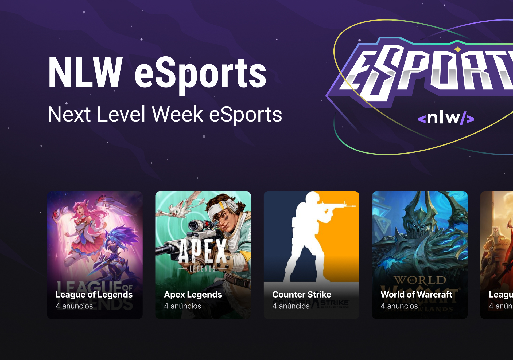

<h1 align="center">
  
</h1>

<p align="center">
  
</p>

## :iphone: Projeto

Aplicativo para lhe ajudar a conectar-se com seu duo e aproveitar com companhia o momento de diversão. Crie anúncios para jogar seus games favoritos quando seus amigos não estiverem disponível com esse App. Desenvolvido no NLW evento promovido pela [Rocketseat](https://www.rocketseat.com.br/).

## :sparkles: Tecnologias

- [ ] Vite
- [ ] React
- [ ] Typescript
- [ ] Gradient colors

## :hammer_and_wrench: Features 

- [ ] Conexão com o backend
- [ ] Listagem dos Games

## 🔖 Layout

Você pode visualizar o layout do projeto através [desse link](https://www.figma.com/community/file/1150897317533332617). É necessário ter conta no [Figma](http://figma.com/) para acessá-lo.

## Executando o projeto

Utilize o **yarn** ou o **npm install** para instalar as dependências do projeto. 
Em seguida, inicie o projeto.

```cl
npm run start
```

ou

```cl
yarn start
```

Lembre-se de criar o seu servidor. [eSport - Server](https://github.com/lucassnts963/nlw-esport-server)


## 📄 Licença

Esse projeto está sob a licença MIT. Veja o arquivo [LICENSE](LICENSE.md) para mais detalhes.

## :newspaper: Projetos Relacionados

- [ ] :cloud: [Servidor](https://github.com/lucassnts963/nlw-esport-server)
- [ ] :iphone: [Mobile](https://github.com/lucassnts963/nlw-esport-mobile)

<br />
